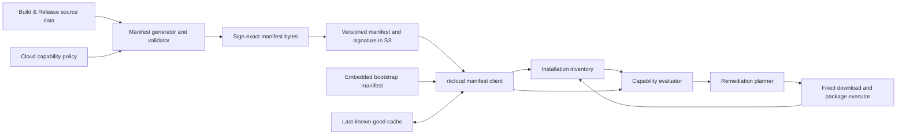
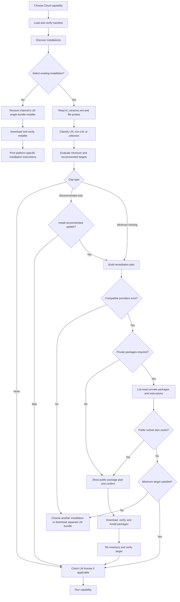
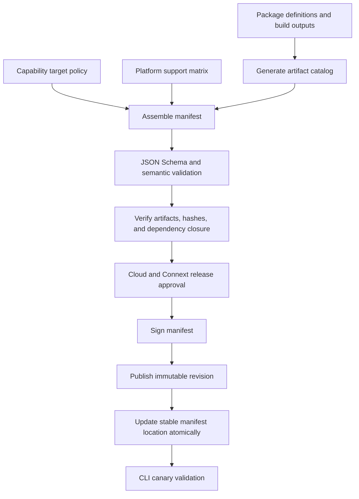

# Connext installation productization for `rticloud`

**Status:** Proposal for discussion  
**Audience:** Connext Professional Build & Release, Connext Cloud, and `rticloud` maintainers  
**Last updated:** 2026-07-16

> **7.7.0.x decision:** This broad design document is superseded for V1 by
> [`connext-installation-productization-v1.md`](connext-installation-productization-v1.md).
> In particular, an existing LM 7.7.0 installation is patched in place with the
> explicit 11-package 7.7.0.1 set; the single-bundle installer is reserved for
> fresh installations.

## Executive summary

`rticloud` currently contains hard-coded knowledge about which Connext version is required, which executable proves that a capability is available, where a public installer or patch is located, and when the Cloud Extras package can be applied. This was appropriate for the first Connext Cloud preview, but it will not scale as Connext 7.7 patch releases, 7.8, LM and non-LM packages, and Engineering Release (ER) previews evolve independently.

This proposal moves product and release policy into a signed public JSON manifest published alongside the Connext artifacts in S3. The CLI will:

1. Determine the Cloud capability the user wants to run.
2. Inventory a selected Connext installation from `rti_versions.xml` and a small number of file probes.
3. Classify it as license-managed (LM), non-license-managed (non-LM), or unknown.
4. Evaluate it against manifest-defined minimum and recommended target states.
5. Produce a remediation plan that preserves the installation mode.
6. Automatically download and, with confirmation, install compatible public `.rtipkg` packages.
7. List exact private non-LM packages that the user must obtain manually.
8. When an existing installation cannot be patched, offer to download a separate LM single-bundle installer and print installation instructions.

The default release channel will be `latest`, which may include ER/preview packages. This is intentional because Connext Cloud is itself a preview offering. Users may select `stable` instead.

The manifest is declarative: it describes desired capability states and the artifacts that can provide them. It does not contain scripts or arbitrary commands. Downloaded artifacts are verified by checksum, and the manifest itself should be signed.

## Goals

- Remove version, URL, package, and patch eligibility policy from the CLI binary.
- Detect whether an installation is Cloud-ready for Gateway, Spy, and Observability.
- Preserve LM versus non-LM mode when remediating an existing installation.
- Support single-bundle LM installations and multi-bundle installations.
- Automatically remediate with public LM or mode-neutral packages when safe.
- Provide actionable manual remediation for private non-LM packages.
- Represent minimum, latest stable, and latest preview/ER states independently.
- Support fourth-component patches, such as `7.7.0` to `7.7.0.1`, without allowing cross-base patching such as `7.7.0` to `7.7.1` or `7.8.0`.
- Reuse the general cadence and caching model of the existing `rticloud` self-update check without coupling the two update systems.
- Give Build & Release a reviewable, testable way to publish Connext Cloud compatibility policy with each release.

## Non-goals

- The CLI will not download private non-LM packages until an authenticated private repository is available to it.
- The CLI will not silently replace or convert an existing non-LM installation with LM content.
- The CLI will not run `.run`, `.dmg`, `.app`, or `.exe` Connext installers. It will download the appropriate installer and print instructions.
- The manifest will not contain shell commands, installer command lines, or executable policy code.
- The initial implementation does not need to manage arbitrary target architectures. `rticloud` requires the host-side artifacts appropriate for the platform on which it runs.

## Terminology and installation model

### License-managed and non-license-managed

- **LM:** Core libraries require a valid license. LM artifacts may be distributed publicly. Evaluators and paid customers can use LM installations.
- **Non-LM:** Core libraries do not perform license checks. These artifacts are limited to paid customers and currently reside in private repositories unavailable to `rticloud`.
- **Mode-neutral package:** A package whose content does not require license protection and can be installed into either LM or non-LM installations. Cloud Extras is the current example.

### Single-bundle and multi-bundle

- **Single-bundle:** Currently LM-only. One installer includes the base host and target content plus components such as WAN, Security Plugins, and OpenSSL. A later patch may still be needed.
- **Multi-bundle:** A base host installer is supplemented with `.rtipkg` packages. In the current non-LM model, `rtiroutingservice` and `rtiddsspy` are in the base host package, while WAN, Security Plugins, and OpenSSL are separate packages.

Bundle kind is useful diagnostic information, but capability readiness should be determined from installed components and files, not from the original bundle label alone.

### Cloud capability requirements

The product-level requirements confirmed for this proposal are:

| Capability | Required runtime content |
|---|---|
| Gateway | `rtiroutingservice`, WAN Transport, Security Plugins, OpenSSL |
| Spy | `rtiddsspy`, WAN Transport, Security Plugins, OpenSSL |
| Observability | `rticollectorservicelite`, WAN Transport, Security Plugins, OpenSSL |

`rticollectorservicelite` is supplied by Cloud Extras for 7.7.0. Starting in 7.7.0.1, it is part of the base package. The manifest must therefore support more than one way to satisfy the logical `collector-lite` requirement.

## Product timeline the design must support

The exact published target IDs and artifact versions will be owned by Build & Release, but the following progression illustrates the policy changes the manifest must express.

### Current state

- Gateway minimum: Connext 7.3 plus Gateway runtime dependencies.
- Observability and Spy minimum: the 7.7.0 patch level required by Cloud plus Cloud Extras.
- The current public Cloud Extras package uses an ER-qualified version and adds Collector Lite and enhanced Spy content to 7.7.0.

The precise mapping between the product shorthand “7.7.0.1” and the component/package versions recorded in `rti_versions.xml` should be confirmed before the first production manifest. For example, the inspected Cloud Extras installation records `7.7.0_RTI_ER_723` on the components it updates while the host `base_version` remains `7.7.0`.

### Near future

- Gateway minimum remains 7.3.
- Gateway recommended stable and latest are 7.7.0.1.
- Observability and Spy minimum are 7.7.0.1.
- Collector Lite and the required Spy changes are included in the 7.7.0.1 base packages, with LM/non-LM package distinctions handled by the artifact catalog.

### Later preview

- Gateway minimum remains 7.3.
- Stable target is 7.7.0.1.
- Latest target is 7.7.0.1 plus `cloud-extras_7.7.0.1_ER_745`.
- Observability and Spy have the same stable and latest split.

### 7.8 generation

- Gateway and Spy minimum become 7.7.0.1.
- Gateway and Spy stable/latest target becomes 7.8.0.
- Observability minimum remains 7.7.0.1.
- Observability stable target becomes 7.8.0.
- Observability latest target becomes 7.8.0 plus `cloud-extras_7.8.0_ER_746`.

The CLI must not calculate these targets by choosing the numerically greatest package. The manifest explicitly names the target for each capability and channel.

## Findings from the current CLI

The current implementation has useful discovery, parsing, package installation, and update primitives, but product policy is distributed across Go code:

- `internal/connext/connext.go` fixes the downloadable installer at 7.7.0 and constructs platform-specific S3 URLs in code.
- Installation validation obtains the version from the directory name rather than `/rti/host/base_version`.
- Gateway and Spy define minimum versions in their own packages.
- `internal/connext/patch.go` hard-codes Cloud Extras 7.7.0, ER 723 detection, the platforms on which it can be downloaded, and the condition under which it is patchable.
- Capability checks combine executable presence, directory-derived versions, and special-case package filename matching.
- Gateway currently chooses a Connext installation before the user chooses Data, Observability, or both. The selection therefore cannot be ranked using the actual requested capability.
- `internal/update/manager.go` already demonstrates a useful pattern for periodic remote checks, cached results, explicit update commands, and non-blocking notifications.

Two implementation details need particular attention:

1. The current version parser extracts every numeric sequence. An ER such as `7.7.0_RTI_ER_745` can therefore be misinterpreted as a fourth numeric patch component. ER identity must be parsed separately from release and revision.
2. `IsLicenseManaged` currently returns `false` when `rti_versions.xml` is absent, unreadable, or unrecognized. Classification should be tri-state so unknown metadata is never treated as confirmed non-LM.

## Findings from Connext installer metadata

### Installation mode is already explicit

No new `rti_versions.xml` field is required to distinguish LM from non-LM in the installations inspected for this proposal.

An LM installation records:

```xml
<host>
    <platform>arm64Darwin</platform>
    <base_version>7.7.0</base_version>
    <installation_type>RTI Connext DDS LM</installation_type>
    <installer_name>rti_connext_dds-7.7.0-lm-arm64Darwin.app</installer_name>
</host>
```

A non-LM installation records:

```xml
<host>
    <platform>arm64Darwin</platform>
    <base_version>7.3.0</base_version>
    <installation_type>RTI Connext DDS Pro</installation_type>
    <installer_name>rti_connext_dds-7.3.0-pro-host-arm64Darwin.app</installer_name>
</host>
```

`installation_type` is authoritative for mode. `installer_name` provides corroboration and provenance. Accepted `installation_type` values should be listed in the manifest so future names can be introduced without a CLI release.

### Component inventory is rich enough for planning

For each installed component, `rti_versions.xml` can record:

- component name, represented by the XML element name;
- architecture;
- Connext or package version;
- optional component-specific version;
- whether that component is licensed;
- friendly name;
- installer/package filename.

The package installer also records installation log entries and newly added files. This means the CLI can group components by package provenance and distinguish base content from subsequently installed packages.

### Component names differ across installer generations

Older installations use component names such as:

- `routing_service_host`
- `utilities_host`
- `real_time_wan_transport_target`
- `secure_target_libraries_openssl`
- `openssl_target`

The newer package-builder output uses names such as:

- `services-routing-bin`
- `utils-bin`
- `addons-security-*`
- `thirdparty-openssl3-*`
- `services-collector-bin`

The manifest should therefore expose stable logical requirements and map each one to one or more metadata/file detectors. Capability definitions should not directly depend on a single historical XML component name.

### Patch compatibility already follows the required boundary

The current `.rtipkg` installer requires the package version to begin with the host's three-part product version. It permits a fourth numeric component. This matches the intended rule:

- `7.7.0` to `7.7.0.1`: patchable.
- `7.7.0` to `7.7.1`: not patchable.
- `7.7.0` to `7.8.0`: not patchable.

The manifest should express the same boundary explicitly on every `.rtipkg` artifact. The CLI must validate it before download, and `rtipkginstall` remains the final enforcement layer.

## Proposed architecture



The implementation should separate five concerns:

1. **Manifest client:** Fetches, verifies, validates, caches, and selects the last-known-good manifest.
2. **Inventory reader:** Parses `rti_versions.xml`, classifies mode, records architecture and provenance, and evaluates safe file probes.
3. **Capability evaluator:** Determines whether minimum and recommended targets are satisfied.
4. **Planner:** Chooses compatible artifact providers and partitions automatic versus manual steps.
5. **Executor:** Downloads public files, verifies checksums, invokes the existing fixed `rtipkginstall` path, and re-inventories the result.

This structure keeps product policy out of the executor and keeps remote data from defining executable behavior.

## Version model

Versions must not be represented as one unstructured list of integers. The normalized model should be:

```json
{
  "base_release": "7.7.0",
  "revision": 1,
  "qualifier": {
    "kind": "er",
    "number": 745
  },
  "display": "7.7.0.1_RTI_ER_745"
}
```

- `base_release` is the three-part compatibility line.
- `revision` is the optional fourth numeric patch component and defaults to zero.
- `qualifier` identifies ER or other preview metadata; it is not a numeric patch component.
- `display` preserves the published spelling for filenames and UX.
- Component-specific versions, such as OpenSSL `3.5.5`, are stored separately from the Connext compatibility version.

Targets are selected explicitly by channel policy. ER numbers are useful identifiers but are not used to infer which preview is product-approved.

## Manifest design

### Format and location

- JSON, validated against a versioned JSON Schema.
- One public v1 manifest initially; split catalogs can be introduced in a later schema if file size becomes significant.
- Published at a stable S3 location with immutable revisioned copies, for example:

```text
.../ConnextCloud/manifests/v1/manifest.json
.../ConnextCloud/manifests/v1/manifest.json.sig
.../ConnextCloud/manifests/v1/revisions/000042/manifest.json
.../ConnextCloud/manifests/v1/revisions/000042/manifest.json.sig
```

The final S3 prefix is a Build & Release decision. Artifact URLs may continue to point at existing `RTI/Bundles/<version>/...` locations.

### Top-level concepts

| Section | Responsibility |
|---|---|
| Metadata | Schema version, revision, generation/expiry times, minimum CLI version, signing key ID |
| Channels | Meaning of `stable` and `latest` |
| Installation modes | Accepted `rti_versions.xml` values for LM and non-LM |
| Requirements | Stable logical component/capability detectors |
| Targets | Complete desired states for a capability at a point in time |
| Capabilities | Minimum and channel-recommended target selection |
| Artifacts | Platform-specific installers and `.rtipkg` providers, compatibility, access, hashes, dependencies |

### Representative manifest

The following example is intentionally incomplete but demonstrates all structural decisions needed for v1.

```json
{
  "schema_version": 1,
  "manifest_revision": 42,
  "generated_at": "2026-07-16T00:00:00Z",
  "expires_at": "2026-10-16T00:00:00Z",
  "minimum_cli_version": "1.2.0",
  "signing_key_id": "connext-cloud-manifest-2026",

  "channels": {
    "stable": {
      "description": "Production-supported Connext components only"
    },
    "latest": {
      "description": "Newest approved Cloud components, including ER previews"
    }
  },

  "installation_modes": {
    "lm": {
      "installation_type_values": ["RTI Connext DDS LM"]
    },
    "non_lm": {
      "installation_type_values": ["RTI Connext DDS Pro"]
    }
  },

  "requirements": {
    "routing-service": {
      "detectors": {
        "all_of": [
          {
            "any_of": [
              {"component": {"name": "routing_service_host"}},
              {"component": {"name": "services-routing-bin"}}
            ]
          },
          {"executable": {"path": "bin/rtiroutingservice"}}
        ]
      }
    },
    "dds-spy": {
      "detectors": {
        "all_of": [
          {
            "any_of": [
              {"component": {"name": "utilities_host"}},
              {"component": {"name": "utils-bin"}}
            ]
          },
          {"executable": {"path": "bin/rtiddsspy"}}
        ]
      }
    },
    "collector-lite": {
      "detectors": {
        "all_of": [
          {"component": {"name": "services-collector-bin"}},
          {"executable": {"path": "bin/rticollectorservicelite"}}
        ]
      }
    },
    "wan": {
      "detectors": {
        "any_of": [
          {"component": {"name": "real_time_wan_transport_target"}},
          {"package_id": "wan-transport"}
        ]
      }
    },
    "security": {
      "detectors": {
        "any_of": [
          {"component": {"name": "secure_target_libraries_openssl"}},
          {"component_name_glob": "addons-security-*-lib"},
          {"package_id": "security-plugins"}
        ]
      }
    },
    "openssl": {
      "detectors": {
        "any_of": [
          {"component": {"name": "openssl_target"}},
          {"component_name_glob": "thirdparty-openssl3-*-lib"},
          {"package_id": "openssl"}
        ]
      }
    }
  },

  "targets": {
    "gateway-min-730": {
      "compatible_base_releases": {"at_least": "7.3.0"},
      "requires": [
        {"id": "routing-service", "version": {"at_least": "7.3.0"}},
        {"id": "wan"},
        {"id": "security"},
        {"id": "openssl"}
      ]
    },
    "gateway-stable-7701": {
      "compatible_base_releases": {"exact": "7.7.0"},
      "display_version": "7.7.0.1",
      "requires": [
        {"id": "routing-service", "version": {"at_least": "7.7.0.1"}},
        {"id": "wan"},
        {"id": "security"},
        {"id": "openssl"}
      ]
    },
    "gateway-latest-7701-er745": {
      "inherits": "gateway-stable-7701",
      "requires_packages": [
        {"package_id": "cloud-extras", "version": "7.7.0.1_RTI_ER_745"}
      ]
    },
    "spy-min-770-cloud-extras": {
      "compatible_base_releases": {"exact": "7.7.0"},
      "requires": [
        {"id": "dds-spy"},
        {"id": "wan"},
        {"id": "security"},
        {"id": "openssl"}
      ],
      "requires_packages": [
        {"package_id": "cloud-extras", "version": "7.7.0_RTI_ER_723"}
      ]
    },
    "spy-stable-7701": {
      "compatible_base_releases": {"exact": "7.7.0"},
      "display_version": "7.7.0.1",
      "requires": [
        {"id": "dds-spy", "version": {"at_least": "7.7.0.1"}},
        {"id": "wan"},
        {"id": "security"},
        {"id": "openssl"}
      ]
    },
    "spy-latest-7701-er745": {
      "inherits": "spy-stable-7701",
      "requires_packages": [
        {"package_id": "cloud-extras", "version": "7.7.0.1_RTI_ER_745"}
      ]
    },
    "observability-min-770": {
      "compatible_base_releases": {"exact": "7.7.0"},
      "requires": [
        {"id": "collector-lite"},
        {"id": "wan"},
        {"id": "security"},
        {"id": "openssl"}
      ]
    },
    "observability-stable-7701": {
      "compatible_base_releases": {"exact": "7.7.0"},
      "display_version": "7.7.0.1",
      "requires": [
        {"id": "collector-lite", "version": {"at_least": "7.7.0.1"}},
        {"id": "wan"},
        {"id": "security"},
        {"id": "openssl"}
      ]
    },
    "observability-latest-7701-er745": {
      "inherits": "observability-stable-7701",
      "requires_packages": [
        {"package_id": "cloud-extras", "version": "7.7.0.1_RTI_ER_745"}
      ]
    },
    "gateway-stable-780": {
      "compatible_base_releases": {"exact": "7.8.0"},
      "display_version": "7.8.0",
      "requires": [
        {"id": "routing-service", "version": {"at_least": "7.8.0"}},
        {"id": "wan"},
        {"id": "security"},
        {"id": "openssl"}
      ]
    },
    "spy-stable-780": {
      "compatible_base_releases": {"exact": "7.8.0"},
      "display_version": "7.8.0",
      "requires": [
        {"id": "dds-spy", "version": {"at_least": "7.8.0"}},
        {"id": "wan"},
        {"id": "security"},
        {"id": "openssl"}
      ]
    },
    "observability-stable-780": {
      "compatible_base_releases": {"exact": "7.8.0"},
      "display_version": "7.8.0",
      "requires": [
        {"id": "collector-lite", "version": {"at_least": "7.8.0"}},
        {"id": "wan"},
        {"id": "security"},
        {"id": "openssl"}
      ]
    }
  },

  "capabilities": {
    "gateway": {
      "minimum_target": "gateway-min-730",
      "recommended_targets": {
        "stable": "gateway-stable-7701",
        "latest": "gateway-latest-7701-er745"
      }
    },
    "spy": {
      "minimum_target": "spy-min-770-cloud-extras",
      "recommended_targets": {
        "stable": "spy-stable-7701",
        "latest": "spy-latest-7701-er745"
      }
    },
    "observability": {
      "minimum_target": "observability-min-770",
      "recommended_targets": {
        "stable": "observability-stable-7701",
        "latest": "observability-latest-7701-er745"
      }
    }
  },

  "artifacts": [
    {
      "id": "cloud-extras-770-er723-darwin-arm64",
      "package_id": "cloud-extras",
      "kind": "rtipkg",
      "maturity": "preview",
      "version": {
        "base_release": "7.7.0",
        "revision": 0,
        "qualifier": {"kind": "er", "number": 723},
        "display": "7.7.0_RTI_ER_723"
      },
      "compatible_base_releases": ["7.7.0"],
      "compatible_installation_modes": ["lm", "non_lm"],
      "content_mode": "neutral",
      "platform": {
        "os": "darwin",
        "arch": "arm64",
        "connext_host_architecture": "arm64Darwin"
      },
      "distribution": {
        "access": "public",
        "url": "https://s3.amazonaws.com/RTI/Bundles/7.7.0/Cloud/rti_connext_dds-7.7.0_RTI_ER_723-arm64Darwin-cloud-extras.rtipkg",
        "sha256": "<sha256>",
        "size": 12345678
      },
      "provides": ["collector-lite"],
      "install_priority": 100
    },
    {
      "id": "cloud-extras-7701-er745-darwin-arm64",
      "package_id": "cloud-extras",
      "kind": "rtipkg",
      "maturity": "preview",
      "version": {
        "base_release": "7.7.0",
        "revision": 1,
        "qualifier": {"kind": "er", "number": 745},
        "display": "7.7.0.1_RTI_ER_745"
      },
      "compatible_base_releases": ["7.7.0"],
      "compatible_installation_modes": ["lm", "non_lm"],
      "content_mode": "neutral",
      "platform": {
        "os": "darwin",
        "arch": "arm64",
        "connext_host_architecture": "arm64Darwin"
      },
      "distribution": {
        "access": "public",
        "url": "https://s3.amazonaws.com/RTI/Bundles/7.7.0/Cloud/<cloud-extras-er745>.rtipkg",
        "sha256": "<sha256>",
        "size": 12345678
      },
      "provides": ["collector-lite", "dds-spy"],
      "install_priority": 110
    },
    {
      "id": "wan-730-non-lm-darwin-arm64",
      "package_id": "wan-transport",
      "kind": "rtipkg",
      "maturity": "stable",
      "version": {
        "base_release": "7.3.0",
        "revision": 0,
        "display": "7.3.0"
      },
      "compatible_base_releases": ["7.3.0"],
      "compatible_installation_modes": ["non_lm"],
      "content_mode": "non_lm",
      "platform": {
        "os": "darwin",
        "arch": "arm64",
        "connext_target_architecture": "arm64Darwin20clang12.0"
      },
      "distribution": {
        "access": "private",
        "filename": "rti_real_time_wan_transport-7.3.0-target-arm64Darwin20clang12.0.rtipkg",
        "instructions_url": "https://community.rti.com/downloads"
      },
      "provides": ["wan"]
    },
    {
      "id": "connext-780-lm-single-linux-amd64",
      "kind": "installer",
      "maturity": "stable",
      "version": {
        "base_release": "7.8.0",
        "revision": 0,
        "display": "7.8.0"
      },
      "installation_mode": "lm",
      "bundle_kind": "single",
      "platform": {"os": "linux", "arch": "amd64"},
      "distribution": {
        "access": "public",
        "url": "https://s3.amazonaws.com/RTI/Bundles/7.8.0/Evaluation/<installer>.run",
        "sha256": "<sha256>",
        "size": 1234567890
      },
      "satisfies_targets": [
        "gateway-stable-780",
        "spy-stable-780",
        "observability-stable-780"
      ]
    }
  ]
}
```

The example defines separate Gateway, Spy, and Observability targets even when some contents are identical. That preserves independent evolution and clearer audit history.

### Release-specific example: Connext 7.7.0.1

The following is a focused example of the entries Build & Release would publish for the upcoming Connext 7.7.0.1 release. It uses macOS ARM64 as one concrete platform slice; the generator would emit equivalent artifact entries for every supported host and target architecture.

This example encodes the expected 7.7.0.1 packaging behavior:

- The normalized three-part compatibility base remains `7.7.0`, with `revision: 1` representing the fourth component in the display version `7.7.0.1`.
- The public LM single bundle satisfies the stable Gateway, Spy, and Observability targets without additional packages.
- The non-LM base host package provides Routing Service, DDS Spy, and Collector Service Lite. Collector Service Lite is therefore no longer supplied by Cloud Extras merely to reach the stable target.
- WAN Transport, Security Plugins, and OpenSSL remain separate private non-LM packages.
- Cloud Extras ER 745 is a public, mode-neutral preview layered on either installation mode only for the `latest` channel.
- When no usable installation exists, the CLI downloads the LM installer, verifies it, and prints instructions. The CLI does not run the installer. That behavior is fixed CLI policy rather than executable content supplied by this manifest.

All values surrounded by angle brackets are publication placeholders. In particular, Build & Release must replace the artifact names, sizes, SHA-256 values, documentation URLs, target architecture, ER contents, and dates from authoritative release metadata before signing the manifest.

```json
{
  "schema_version": 1,
  "manifest_revision": 43,
  "generated_at": "<generated-at-rfc3339>",
  "expires_at": "<expires-at-rfc3339>",
  "minimum_cli_version": "1.2.0",
  "signing_key_id": "connext-cloud-manifest-2026",

  "channels": {
    "stable": {
      "description": "Connext 7.7.0.1 production-supported components"
    },
    "latest": {
      "description": "Connext 7.7.0.1 plus approved Cloud preview updates"
    }
  },

  "installation_modes": {
    "lm": {
      "installation_type_values": ["RTI Connext DDS LM"]
    },
    "non_lm": {
      "installation_type_values": ["RTI Connext DDS Pro"]
    }
  },

  "requirements": {
    "routing-service": {
      "detectors": {
        "all_of": [
          {
            "any_of": [
              {"component": {"name": "routing_service_host"}},
              {"component": {"name": "services-routing-bin"}}
            ]
          },
          {"executable": {"path": "bin/rtiroutingservice"}}
        ]
      }
    },
    "dds-spy": {
      "detectors": {
        "all_of": [
          {
            "any_of": [
              {"component": {"name": "utilities_host"}},
              {"component": {"name": "utils-bin"}}
            ]
          },
          {"executable": {"path": "bin/rtiddsspy"}}
        ]
      }
    },
    "collector-lite": {
      "detectors": {
        "all_of": [
          {"component": {"name": "services-collector-bin"}},
          {"executable": {"path": "bin/rticollectorservicelite"}}
        ]
      }
    },
    "wan": {
      "detectors": {
        "any_of": [
          {"component": {"name": "real_time_wan_transport_target"}},
          {"package_id": "wan-transport"}
        ]
      }
    },
    "security": {
      "detectors": {
        "any_of": [
          {"component": {"name": "secure_target_libraries_openssl"}},
          {"component_name_glob": "addons-security-*-lib"},
          {"package_id": "security-plugins"}
        ]
      }
    },
    "openssl": {
      "detectors": {
        "any_of": [
          {"component": {"name": "openssl_target"}},
          {"component_name_glob": "thirdparty-openssl3-*-lib"},
          {"package_id": "openssl"}
        ]
      }
    }
  },

  "targets": {
    "gateway-stable-7701": {
      "compatible_base_releases": {"exact": "7.7.0"},
      "display_version": "7.7.0.1",
      "requires": [
        {"id": "routing-service", "version": {"at_least": "7.7.0.1"}},
        {"id": "wan"},
        {"id": "security"},
        {"id": "openssl"}
      ]
    },
    "spy-stable-7701": {
      "compatible_base_releases": {"exact": "7.7.0"},
      "display_version": "7.7.0.1",
      "requires": [
        {"id": "dds-spy", "version": {"at_least": "7.7.0.1"}},
        {"id": "wan"},
        {"id": "security"},
        {"id": "openssl"}
      ]
    },
    "observability-stable-7701": {
      "compatible_base_releases": {"exact": "7.7.0"},
      "display_version": "7.7.0.1",
      "requires": [
        {"id": "collector-lite", "version": {"at_least": "7.7.0.1"}},
        {"id": "wan"},
        {"id": "security"},
        {"id": "openssl"}
      ]
    },
    "gateway-latest-7701-er745": {
      "inherits": "gateway-stable-7701",
      "requires_packages": [
        {"package_id": "cloud-extras", "version": "7.7.0.1_RTI_ER_745"}
      ]
    },
    "spy-latest-7701-er745": {
      "inherits": "spy-stable-7701",
      "requires_packages": [
        {"package_id": "cloud-extras", "version": "7.7.0.1_RTI_ER_745"}
      ]
    },
    "observability-latest-7701-er745": {
      "inherits": "observability-stable-7701",
      "requires_packages": [
        {"package_id": "cloud-extras", "version": "7.7.0.1_RTI_ER_745"}
      ]
    }
  },

  "capabilities": {
    "gateway": {
      "minimum_target": "gateway-stable-7701",
      "recommended_targets": {
        "stable": "gateway-stable-7701",
        "latest": "gateway-latest-7701-er745"
      }
    },
    "spy": {
      "minimum_target": "spy-stable-7701",
      "recommended_targets": {
        "stable": "spy-stable-7701",
        "latest": "spy-latest-7701-er745"
      }
    },
    "observability": {
      "minimum_target": "observability-stable-7701",
      "recommended_targets": {
        "stable": "observability-stable-7701",
        "latest": "observability-latest-7701-er745"
      }
    }
  },

  "artifacts": [
    {
      "id": "connext-7701-lm-single-darwin-arm64",
      "kind": "installer",
      "maturity": "stable",
      "version": {
        "base_release": "7.7.0",
        "revision": 1,
        "display": "7.7.0.1"
      },
      "installation_mode": "lm",
      "bundle_kind": "single",
      "platform": {
        "os": "darwin",
        "arch": "arm64",
        "connext_host_architecture": "arm64Darwin"
      },
      "distribution": {
        "access": "public",
        "url": "https://s3.amazonaws.com/RTI/Bundles/7.7.0.1/Evaluation/<7.7.0.1-lm-single-installer>.dmg",
        "sha256": "<sha256>",
        "size": 1234567890,
        "instructions_url": "<lm-installation-instructions-url>"
      },
      "satisfies_targets": [
        "gateway-stable-7701",
        "spy-stable-7701",
        "observability-stable-7701"
      ]
    },
    {
      "id": "connext-7701-non-lm-host-darwin-arm64",
      "package_id": "connext-host",
      "kind": "rtipkg",
      "maturity": "stable",
      "version": {
        "base_release": "7.7.0",
        "revision": 1,
        "display": "7.7.0.1"
      },
      "compatible_base_releases": ["7.7.0"],
      "compatible_installation_modes": ["non_lm"],
      "content_mode": "non_lm",
      "platform": {
        "os": "darwin",
        "arch": "arm64",
        "connext_host_architecture": "arm64Darwin"
      },
      "distribution": {
        "access": "private",
        "filename": "<7.7.0.1-non-lm-host-package>.rtipkg",
        "instructions_url": "<private-repository-instructions-url>"
      },
      "provides": ["routing-service", "dds-spy", "collector-lite"]
    },
    {
      "id": "wan-7701-non-lm-darwin-arm64-target",
      "package_id": "wan-transport",
      "kind": "rtipkg",
      "maturity": "stable",
      "version": {
        "base_release": "7.7.0",
        "revision": 1,
        "display": "7.7.0.1"
      },
      "compatible_base_releases": ["7.7.0"],
      "compatible_installation_modes": ["non_lm"],
      "content_mode": "non_lm",
      "platform": {
        "os": "darwin",
        "arch": "arm64",
        "connext_target_architecture": "<darwin-arm64-target-architecture>"
      },
      "distribution": {
        "access": "private",
        "filename": "<7.7.0.1-wan-target-package>.rtipkg",
        "instructions_url": "<private-repository-instructions-url>"
      },
      "provides": ["wan"]
    },
    {
      "id": "security-7701-non-lm-darwin-arm64-target",
      "package_id": "security-plugins",
      "kind": "rtipkg",
      "maturity": "stable",
      "version": {
        "base_release": "7.7.0",
        "revision": 1,
        "display": "7.7.0.1"
      },
      "compatible_base_releases": ["7.7.0"],
      "compatible_installation_modes": ["non_lm"],
      "content_mode": "non_lm",
      "platform": {
        "os": "darwin",
        "arch": "arm64",
        "connext_target_architecture": "<darwin-arm64-target-architecture>"
      },
      "distribution": {
        "access": "private",
        "filename": "<7.7.0.1-security-target-package>.rtipkg",
        "instructions_url": "<private-repository-instructions-url>"
      },
      "provides": ["security"]
    },
    {
      "id": "openssl-7701-non-lm-darwin-arm64-target",
      "package_id": "openssl",
      "kind": "rtipkg",
      "maturity": "stable",
      "version": {
        "base_release": "7.7.0",
        "revision": 1,
        "display": "7.7.0.1"
      },
      "compatible_base_releases": ["7.7.0"],
      "compatible_installation_modes": ["non_lm"],
      "content_mode": "non_lm",
      "platform": {
        "os": "darwin",
        "arch": "arm64",
        "connext_target_architecture": "<darwin-arm64-target-architecture>"
      },
      "distribution": {
        "access": "private",
        "filename": "<7.7.0.1-openssl-target-package>.rtipkg",
        "instructions_url": "<private-repository-instructions-url>"
      },
      "provides": ["openssl"]
    },
    {
      "id": "cloud-extras-7701-er745-darwin-arm64",
      "package_id": "cloud-extras",
      "kind": "rtipkg",
      "maturity": "preview",
      "version": {
        "base_release": "7.7.0",
        "revision": 1,
        "qualifier": {"kind": "er", "number": 745},
        "display": "7.7.0.1_RTI_ER_745"
      },
      "compatible_base_releases": ["7.7.0"],
      "compatible_installation_modes": ["lm", "non_lm"],
      "content_mode": "neutral",
      "platform": {
        "os": "darwin",
        "arch": "arm64",
        "connext_host_architecture": "arm64Darwin"
      },
      "distribution": {
        "access": "public",
        "url": "https://s3.amazonaws.com/RTI/Bundles/7.7.0.1/Cloud/<7.7.0.1-er745-cloud-extras>.rtipkg",
        "sha256": "<sha256>",
        "size": 12345678
      },
      "provides": ["<er745-updated-requirements>"],
      "install_priority": 110
    }
  ]
}
```

The release generator should expand this platform slice, validate that every target has at least one satisfiable provider set per supported installation mode, and fail publication if Collector Service Lite is absent from either 7.7.0.1 base bundle. The example models the non-LM host as an `rtipkg`; Build & Release should confirm the actual delivery kind and model it as an `installer` with `bundle_kind: "multi"` instead if that is how the host is published. The numeric sizes are illustrative and must be replaced with the generated artifact sizes.

### Artifact rules

Each artifact must declare:

- a stable unique ID and logical package ID;
- artifact kind: `installer` or `rtipkg`;
- maturity: `stable` or `preview`;
- normalized version;
- exact compatible three-part base release or releases;
- compatible installation modes;
- content mode: `lm`, `non_lm`, or `neutral`;
- OS, Go architecture, and applicable Connext host/target architecture;
- public URL and integrity metadata, or private filename and manual instructions;
- logical requirements it provides;
- dependencies and conflicts, if any;
- deterministic priority when multiple artifacts can satisfy the same requirement.

For public artifacts, URL, SHA-256, and size are required. Private artifacts must not contain a public URL.

### Target rules

A target is a complete desired state, not an upgrade procedure. It includes:

- compatible base release constraint;
- required logical components and their component/package version constraints;
- required exact package markers for preview states;
- optional prohibited packages or known-bad revisions.

The host's three-part `base_version` anchors patch compatibility. A target must not assume that installing a patch rewrites that host value; fourth-component constraints belong on the components or packages that must be updated.

Targets may inherit from another target, but the manifest validator must expand and validate inheritance before publication. Cycles are invalid.

### Why target states are preferable to procedural upgrade rules

The same target may be reached in several ways:

- already included in a single bundle;
- included in a later base package;
- supplied by one mode-neutral patch;
- supplied by several mode-specific packages;
- impossible to reach by patching the selected base release.

The CLI evaluates the desired state, then selects compatible providers for only the missing requirements. This avoids encoding every possible starting package combination as a separate scripted upgrade path.

## Resolution and planning algorithm

For a requested capability, the CLI should:

1. Load the newest valid signed manifest from remote, cache, or the embedded bootstrap snapshot.
2. Select the configured channel. Default: `latest`.
3. Discover candidate installations from `NDDSHOME`, `CONNEXTDDS_DIR`, project configuration, and standard paths.
4. Read `/rti/host` and all component installations from `rti_versions.xml`.
5. Normalize platform, base release, component versions, component-specific versions, and package provenance.
6. Classify installation mode using manifest-defined `installation_type` values. Unrecognized or unreadable metadata becomes `unknown`.
7. Evaluate the capability's minimum target.
8. Evaluate the capability's channel-recommended target.
9. Classify the gap:
   - `none`;
   - `recommended-only`, which may be skipped;
   - `minimum-missing`, which blocks execution.
10. For each missing requirement, find provider artifacts that match base release, mode, platform, dependencies, and target policy.
11. Prefer already installed providers, then public providers, using manifest priority to break ties.
12. Partition the plan into:
   - downloadable public `.rtipkg` actions;
   - manual private package actions;
   - separate installer fallback.
13. Show the plan. Require confirmation before modifying an existing installation.
14. Download public packages, verify size and SHA-256, and invoke the CLI-owned `rtipkginstall` command in dependency order.
15. Re-read the installation inventory after each package and verify the final target.
16. For LM installations, ensure that a license is available before starting Connext processes.

If there is no compatible provider for a mandatory requirement, the selected installation is not patchable for that target. The user may select another installation or download the channel's LM single-bundle installer.

## Proposed UX

### First-run ordering

Gateway setup should choose Data, Observability, or both before choosing a Connext installation. Spy has an implicit Spy capability. This lets the CLI rank installations by actual readiness.

Candidate labels should summarize readiness rather than only path and version:

```text
Select Connext installation:

  /Applications/rti_connext_dds-7.7.0
    LM · Gateway ready · Observability needs Cloud Extras

  /Applications/rti_connext_dds-7.3.0
    non-LM · Gateway needs 3 private packages

  Download a separate Cloud-ready Connext LM installation
  Enter another path
  Cancel
```

### End-to-end decision flow



### Required versus recommended remediation

Mandatory gap:

```text
Connext 7.7.0 at /opt/rti.com/rti_connext_dds-7.7.0 is not ready for
Observability. The following required component is missing:

  • Collector Service Lite

rticloud can install the public Connext Cloud Extras package without changing
this installation's LM/non-LM mode.

Install Connext Cloud Extras now? [Y/n]
```

Recommended-only gap:

```text
This installation meets the minimum Gateway requirements.

A newer preview component set is available on your "latest" channel:
  • Connext Cloud Extras 7.7.0.1 ER 745

Update now, continue without updating, or switch to the stable channel?
```

### Non-LM manual remediation

```text
The selected non-LM installation needs packages that rticloud cannot download
from the public repository:

  • rti_real_time_wan_transport-7.7.0-target-<architecture>.rtipkg
  • rti_security_plugins-7.7.0-target-openssl-<version>-<architecture>.rtipkg

Download these packages from the RTI customer repository, install them into:
  /opt/rti.com/rti_connext_dds-7.7.0

Then rerun:
  rticloud gateway

Tip: You can download a separate, Cloud-ready Connext LM installation without
modifying your current Connext installation.
```

If OpenSSL is confirmed to be public and mode-neutral, the CLI may offer to install it automatically while still listing WAN and Security Plugins as manual steps. Artifact access and compatibility fields, rather than package-name assumptions, decide this behavior.

### Non-patchable installation

```text
Connext 7.7.0 cannot be patched to the recommended 7.8.0 target. Connext
packages can only update the same three-part base release.

Choose how to continue:
  • Continue with 7.7.0 (minimum requirements are satisfied)
  • Select another installation
  • Download the 7.8.0 LM single-bundle installer
  • Cancel
```

The “continue” option is omitted when the selected installation does not meet the minimum target.

### Download-only installer flow

The CLI downloads and verifies the installer but does not launch it. The final message is platform-specific:

```text
Downloaded Connext Professional 7.8.0 LM to:
  /Users/alex/Downloads/rti_connext_dds-7.8.0-lm-arm64Darwin.dmg

Next steps:
  1. Open the disk image and run the Connext installer.
  2. Keep the suggested installation directory or note the directory you choose.
  3. Rerun: rticloud gateway
```

Linux should show the downloaded `.run` command, and Windows should instruct the user to run the downloaded `.exe`.

### Non-interactive behavior

When prompts are unavailable:

- Never install packages automatically.
- Print the computed plan and the explicit command needed to continue.
- Return a user-facing error when a minimum requirement is missing.
- Recommended-only updates never block execution.
- A future `--yes` option may approve public `.rtipkg` actions, but it must not approve private downloads or replacement installations.

## Commands and configuration

Suggested configuration key:

```json
{
  "connext_release_channel": "latest"
}
```

Suggested user commands:

```text
rticloud configure --connext-channel stable|latest
rticloud connext status [--path PATH] [--capability gateway|spy|observability]
rticloud connext update [--path PATH] [--capability gateway|spy|observability]
```

`rticloud connext status` should print mode, base release, architecture, satisfied requirements, missing requirements, current channel, and available remediation without making changes.

Connext update-check state must use keys separate from the CLI self-updater, for example:

```text
connext_manifest_last_check
connext_manifest_etag
connext_manifest_revision
connext_manifest_path
```

The initial check interval can match the CLI updater's seven-day interval. Capability preflight may use a cached manifest without performing a network request on every run.

## Additional lifecycle examples

### Example A: no installation, `latest` channel

1. User chooses Gateway.
2. No compatible installation is discovered.
3. Manifest maps Gateway `latest` to the newest approved preview target.
4. CLI selects the matching LM single-bundle installer for OS/architecture.
5. CLI downloads and verifies the installer.
6. CLI prints installation and rerun instructions.

### Example B: non-LM 7.3 base host, Gateway

1. `rti_versions.xml` identifies `RTI Connext DDS Pro`.
2. `rtiroutingservice` is present in the base host package.
3. WAN, Security Plugins, and OpenSSL are evaluated independently.
4. Any public mode-neutral dependency may be offered automatically.
5. Private non-LM packages are listed by exact filename.
6. The user is also offered a separate LM installation that leaves the non-LM installation untouched.

### Example C: LM 7.7.0 without Cloud Extras, Observability

1. The installation is classified as LM.
2. WAN, Security Plugins, and OpenSSL are already present in the single bundle.
3. `rticollectorservicelite` is missing.
4. The manifest identifies a public mode-neutral Cloud Extras provider compatible with base release 7.7.0.
5. After confirmation, the CLI downloads, verifies, and installs it.
6. The CLI re-reads `rti_versions.xml`, confirms Collector Lite, and continues.

### Example D: non-LM 7.7.0 with network dependencies but no Collector Lite

1. The installation is classified as non-LM.
2. Required private WAN/Security packages are already installed.
3. Cloud Extras is declared mode-neutral and public.
4. The CLI installs only Cloud Extras, preserving non-LM mode.

### Example E: stable versus latest

1. A 7.7.0.1 installation meets the stable target without extra packages.
2. The latest target additionally requires Cloud Extras ER 745.
3. A `stable` user is told the installation is current.
4. A `latest` user is offered the ER 745 package.

### Example F: 7.7.0 installation when 7.8.0 is recommended

1. The 7.7.0 installation still satisfies the capability minimum.
2. No `.rtipkg` can cross the three-part base boundary to 7.8.0.
3. The CLI offers to continue or download a separate 7.8.0 LM single bundle.
4. The existing installation is not modified.

### Example G: offline execution

1. The network manifest check fails.
2. The CLI uses a valid last-known-good cached manifest, or its embedded bootstrap manifest if no cache exists.
3. If the installation satisfies the known minimum, the capability runs.
4. A recommended update check failure never blocks execution.
5. If the embedded/cached policy cannot evaluate a newly encountered installation safely, the CLI reports that limitation rather than guessing.

## Security and failure handling

The manifest controls executable downloads and must be treated as a software supply-chain input.

### Manifest authenticity

- Publish a detached Ed25519 signature over the exact bytes of `manifest.json`.
- Embed trusted public verification keys in `rticloud`.
- Include `signing_key_id` to support planned key rotation.
- Reject unsigned manifests, unknown signing keys, invalid signatures, unsupported schemas, and expired manifests.
- Retain the last-known-good manifest when a new one fails validation.

### Artifact integrity

- Require HTTPS for public URLs.
- Require SHA-256 and expected size.
- Download to a temporary file, verify fully, then rename atomically.
- Delete invalid or partial downloads.
- Consider restricting public artifact hosts to approved RTI domains/S3 buckets.

### Safe execution boundary

- The manifest may identify artifact kind and dependencies, but may not supply commands or arguments.
- The CLI owns the fixed invocation of `rtipkginstall`.
- Paths used for probes must be relative to the selected Connext root and must not escape it.
- Installers are downloaded only; they are never executed by `rticloud`.
- An unknown installation mode may not receive LM- or non-LM-specific packages. It may only be diagnosed until mode is resolved.

### Post-install verification

- Re-read `rti_versions.xml` after each package.
- Re-evaluate the promised requirements rather than trusting a successful exit status.
- Stop the remaining plan if inventory does not match the artifact's declared `provides` list.
- Preserve package installer output for diagnostics.

## Build & Release ownership and publishing workflow

The manifest should be generated from reviewed source data, not edited directly in S3.



Suggested ownership split:

| Data | Proposed owner |
|---|---|
| Artifact filenames, URLs, hashes, sizes, platforms, component contents | Connext Build & Release |
| LM/non-LM/neutral content classification and distribution access | Connext Build & Release/Product Security |
| Capability requirements | Connext Cloud with Connext component owners |
| Minimum, stable, and latest target selection | Connext Cloud release owner |
| Schema and CLI compatibility | `rticloud` maintainers |
| Signing and publication credentials | Build & Release/Product Security |

The preferred pipeline derives as much artifact metadata as possible from package definitions and build output. Human-authored policy should select approved targets and declare any aliases that cannot be generated reliably.

## Manifest validation requirements

The publisher should fail before signing if any of the following is true:

- IDs are duplicated or references are unresolved.
- Target inheritance contains a cycle.
- A capability lacks minimum, stable, or latest targets.
- A public artifact lacks URL, SHA-256, or size.
- A private artifact exposes a public URL.
- A package claims compatibility across different three-part base releases.
- An LM-specific package claims compatibility with non-LM, or vice versa.
- A mode-neutral package does not explicitly list every supported installation mode.
- A target cannot be satisfied for any supported platform/mode combination unless it is explicitly manual-only.
- Artifact dependencies contain a cycle or cannot be satisfied.
- Multiple providers have equal priority without an explicit deterministic tie-break.
- A probe contains an absolute path or parent traversal.
- Stable targets depend on preview artifacts.
- `latest` points at an artifact that has not been explicitly approved for Connext Cloud.
- The manifest requires a CLI version newer than the publisher intended.

Release validation should also run fixture-based evaluations for representative `rti_versions.xml` files, including:

- 7.3 non-LM base only;
- 7.3 non-LM with WAN/Security/OpenSSL;
- 7.7.0 LM single bundle before and after Cloud Extras;
- 7.7.0 non-LM with partial packages;
- 7.7.0.1 base with Collector Lite included;
- ER-qualified component versions;
- future 7.8.0 installations;
- unknown and malformed installation metadata.

## Proposed rollout

### Phase 1: schema and inventory

- Agree on logical requirement IDs and version semantics.
- Implement strict `rti_versions.xml` inventory and tri-state mode detection.
- Collect representative installation fixtures from Build & Release.
- Define and validate the JSON Schema.
- Add `rticloud connext status` using an embedded manifest only.

### Phase 2: signed remote policy and dry-run planning

- Build the manifest generation/signing pipeline.
- Fetch, verify, cache, and fall back to an embedded manifest.
- Evaluate minimum and recommended targets.
- Print remediation plans without downloading or installing packages.
- Validate plans against real LM and non-LM installations.

### Phase 3: public package remediation

- Add verified public `.rtipkg` download.
- Add confirmation and fixed package installation.
- Re-inventory and verify after installation.
- Retire Cloud Extras version/URL special cases from Go code.

### Phase 4: installer discovery and periodic updates

- Download the channel-appropriate LM single-bundle installer and print instructions.
- Add the separate Connext update-check interval and notification.
- Add channel configuration and `rticloud connext update`.

### Phase 5: private repository integration, if available

- Add authenticated private artifact retrieval without changing manifest target semantics.
- Convert eligible non-LM manual steps into verified automatic downloads.

## Compatibility and migration

- Ship an embedded initial manifest containing all behavior currently hard-coded in the CLI.
- During a transition release, compare manifest evaluation with existing checks and log disagreements.
- Keep the current license download flow; invoke it after installation readiness is established and before running an LM executable.
- Existing project-local `connext_home` values remain valid and are inventoried first.
- Do not rewrite a project's selected installation merely because a newer separate installation is downloaded.
- Once remote behavior is proven, remove installer URLs, Cloud Extras URLs, ER markers, and version-specific patch logic from Go.

## Topics for Build & Release discussion

1. **Canonical component vocabulary:** Can the package build produce a stable logical component catalog, or should the manifest generator maintain aliases between legacy and new component names?
2. **OpenSSL distribution:** Is each standalone OpenSSL package public and mode-neutral, or does access vary by release/platform?
3. **Current 7.7 patch identity:** What exact `rti_versions.xml` component/package predicates correspond to the product requirement described as 7.7.0.1 plus Cloud Extras?
4. **Artifact metadata generation:** Which current build outputs can provide filenames, hashes, sizes, dependencies, and component `provides` data automatically?
5. **Architecture mapping:** Which host and target architecture strings should map to each Go `GOOS/GOARCH` pair supported by `rticloud`?
6. **Private package instructions:** What stable customer-repository URL and package naming information may be published in the public manifest?
7. **Signing ownership:** Which team owns the offline signing key, rotation process, emergency revocation, and publication role?
8. **Rollback policy:** Should clients enforce monotonically increasing manifest revisions, with rollback performed by publishing a new revision that restores older target selections?
9. **Expiry and offline window:** How long should a signed manifest remain valid, and how long may a cached expired manifest be used to run already-satisfied minimum capabilities?
10. **Known-bad releases:** Should v1 include explicit deny rules for withdrawn packages or component revisions?

## Recommended decisions for v1

- Use one signed JSON manifest and detached signature.
- Treat `/rti/host/installation_type` as authoritative mode metadata.
- Use tri-state mode classification and fail safely on unknown values.
- Use stable logical requirements with manifest-defined alternative detectors.
- Select minimum/stable/latest targets explicitly rather than calculating “newest.”
- Default to `latest`, including approved ER previews.
- Permit package installation only within the same three-part base release.
- Automatically handle public compatible packages only after confirmation.
- Download but never launch full Connext installers.
- Use an embedded bootstrap manifest plus a last-known-good cache.
- Keep private non-LM remediation manual until authenticated repository access exists.

These decisions cover the known one-year evolution from 7.7 Cloud Extras through 7.8 while leaving room for later authenticated private repositories and additional capabilities without another redesign.
